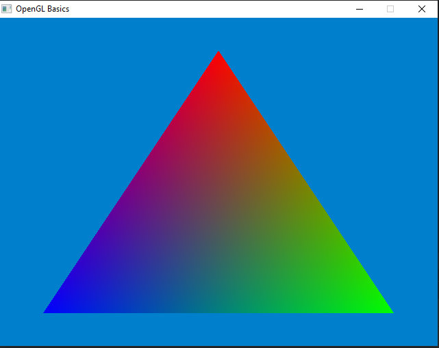

# OpenGL Basics

OpenGL é uma especificação que informa aos fabricantes de GPUs quais tipos de funcionalidades devem ser implementadas em uma GPU e a sua API para serem utilizadas pelos programadores. Essas definições foram criadas a partir da colaboração entre universidades e empresas.

No ponto de vista dos programadores o OpenGL é um conjunto de comandos gráficos (funções) que nos permite interagir com a GPU no seu Pipeline de Renderização (Graphics Pipeline).


## 🎯 Objetivo do Projeto

O objetivo desse projeto é mapear a minha jornada de aprendizado do OpenGL e da área de Computação Gráfica e Graphics Programming. No fim desse arquivo há uma seção com imagens e/ou vídeos que irão representar o estado atual da aplicação. O projeto está sendo desenvolvido em C++

Há, também, uma seção listando os principais conhecimentos aprendidos e implementados no projeto.

Essas seções serão atualizadas periodicamente a cada conjunto de novos conceitos e técnicas aprendidas.

O código estará comentado (em Inglês) o máximo possível para ajudar tanto o meu aprendizado quanto o seu :)


## 🎮 Características Principais do OpenGL

- **Multiplataforma**: Funciona nos Sistemas Operacionais mais populares (Windows, Linux, macOS, Android, iOS).
- **Linguagem de Shader**: Utiliza GLSL para programação de Shaders que serão executados no Pipeline Gráfico.
- **Pipeline Programável** -  Possibilita que os programadores possam desenvolver, compilar e executar aplicações nas GPUs gerando efeitos visuais interessantes para criação de aplicações gráficas, além de tirar a sobrecarga de processamento da CPU.
- **API de Baixo Nível**: Dá acesso direto a funções gráficas, mas exige gerenciamento manual de recursos. O programador é responsável por alocar os recursos na memória da GPU, ativar buffers que serão utilizados, vincular e compilar os programas que serão executados nos pipeline (Shaders) via código, o que possibilita um grande controle do Hardware Gráfico. 


## 📚 Principais conceitos aprendidos e abordados atualmente no Projeto
- **Uso básico do SDL para Setup da Aplicação** - Input Handling, Criação de Janela e Configuração de Contexto do OpenGL
- **Visão geral das etapas do Pipeline Gráfico em OpenGL** - (Vertex Specification, Vertex Shader, Tessellation, Geometry Shader, Vertex Post-Processing, Primitive Assembly, Rasterization, Fragment Shader e Per Sample Operations) 
- **Arquitetura base de uma aplicação gráfica** - Initialization, Vertex Specification, Criação do GraphicsPipeline (Shaders), Main Loop e CleanUp.
- **Modularização do projeto em múltiplos arquivos** -  Gerenciamento dos dados e objetos (Janela, buffers e etc) via passagem por referência para ter o projeto modularizado e com eficiência no processo de compilação do C++.
- **Vertex Array Objects (VAOs) e Vertex Buffer Objects (VBOs)**
- **Uso dos Shaders no Pipeline Gráfico do OpenGL**
- **Workflow geral dos dados durante o pipeline e sua interação com o OpenGL State Machine** - Criação e seleção de VAOs para layouts de leitura de dados, VBOs para armazenamento dos dados, passagem dos valores computados na CPU para GPU, criação de program objects com os shaders anexados e etc. 

## 🤖 Bibliotecas Utilizadas

- **SDL3** - Para Input Handling, OpenGL Context e Criação de Janelas.
- **Glad** - Para ter acesso aos cabeçalhos para as funções do OpenGL.
- **CMake** - Para build e link de dependências dinâmicamente.


## 🛠️ Ferramentas de Desenvolvimento Utilizadas
- **CLion (Non-commercial license)** -  IDE para desenvolvimento.

## 👨‍💻 Instalação e Configuração

### Pré-requisitos:
- CLion
- CMake
- Git

### Instalação:

1. **Clone o repositório**
```bash
git clone <repository-url>
cd pasta-do-projeto
```

1. **Crie um projeto C++ com CLion e CMakeLists.txt incluso**

    Caso esteja usando outra IDE acredito que configurando corretamente o CMake para build do projeto deva funcionar normalmente.

2. **Copie os Arquivos do repositório para o projeto**
   
## ⚙️ Execução do Projeto:

1. **Realize o build com o CMake para compilar o projeto a partir do script contido no CMakeLists.txt** 
   
    Esse processo irá compilar o projeto e linkar as bibliotecas de maneira local e dinâmica no projeto.

2. **Copie a dll do SDL3 para o diretório do arquivo executável**
   
   Ao compilar os arquivos o CLion gera a pasta "cmake-build-debug" contendo as dependências linkadas e o arquivo executavel. Na pasta _.deps dentro de sdl3-build copie a dll do SDL3 (SDL3.dll) e cole onde está o executável do projeto.

3. **Execute o projeto na IDE**
   


## 🖼️ Estado atual da aplicação

Abaixo temos o estado atual da aplicação que renderiza um triangulo com cores interpoladas a partir da passagem de multiplos parâmetros no Vertex Shader e uso de multiplos VBOs para leitura (a partir dos VAOs) e armazenamento das informações nas propriedades do Vertex Shader e Fragment Shader.



## 🔗 Links Úteis

- [Documentação estruturada do OpenGL](https://docs.gl/)
- [Visualizador Web do OpenGL Context e State Machine](https://webglfundamentals.org/webgl/lessons/resources/webgl-state-diagram.html?exampleId=triangle#no-help)
- [Principal Material Didático usado](https://youtube.com/playlist?list=PLvv0ScY6vfd9zlZkIIqGDeG5TUWswkMox&si=46Cj6d09fSI4T7vY)

